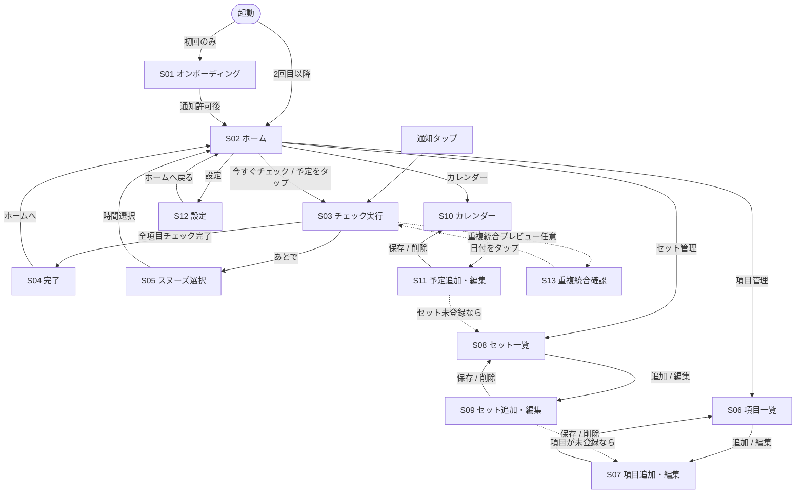

# 画面遷移図 — デルカク✓

画面IDは [02-screens.md](02-screens.md) と対応。

## 主要な遷移ルール

1. **初回起動のみ S01 を経由する。** 2回目以降はホーム（S02）が常に起点。
2. **通知タップは常に S03（チェック実行）へ直行する。** ホームを経由させない（3タップ以内の方針に合致）。
3. **S03 → S04 は自動遷移。** 全項目チェックでユーザー操作なしに完了画面へ進む。
4. **S04 からの遷移先はホームのみ。** 完了画面で迷わせないため選択肢を絞る。
5. **項目／セット未登録時の誘導。** セット作成画面（S09）で項目が0件の場合、項目追加（S07）へ誘導。予定作成画面（S11）でセットが0件の場合、セット一覧（S08）へ誘導する。これにより「使い始めの詰まり」を防ぐ。
6. **S13（重複統合確認）は任意機能。** MVPでは実装せず、将来必要に応じて S03 の直前に挿入する設計とする（点線で表現）。
